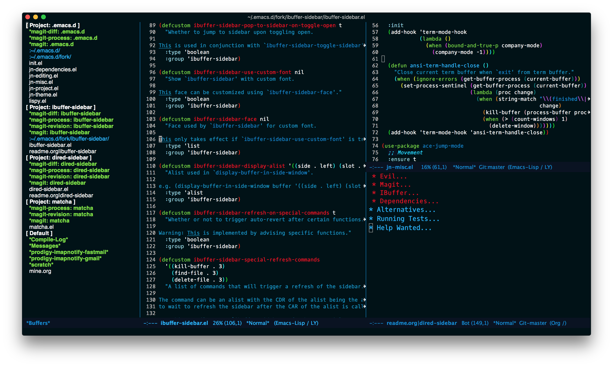
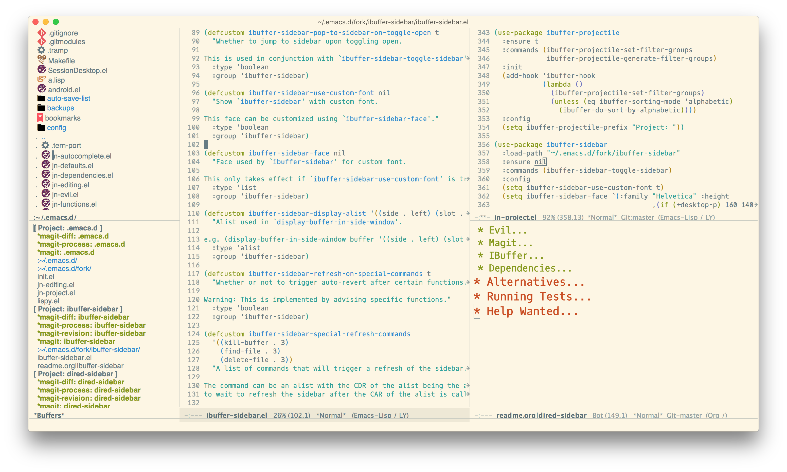

#+TITLE: IBuffer Sidebar

[[https://github.com/jojojames/ibuffer-sidebar/actions/workflows/ci.yml][file:https://github.com/jojojames/ibuffer-sidebar/actions/workflows/ci.yml/badge.svg]]
[[https://melpa.org/#/ibuffer-sidebar][file:https://melpa.org/packages/ibuffer-sidebar-badge.svg]]
[[https://stable.melpa.org/#/ibuffer-sidebar][file:https://stable.melpa.org/packages/ibuffer-sidebar-badge.svg]]
[[https://elpa.gnu.org/packages/ibuffer-sidebar.html][file:https://elpa.gnu.org/packages/ibuffer-sidebar.svg]]

* Screenshots
  

  When used with [[https://github.com/jojojames/dired-sidebar][dired-sidebar]].

  
* Installation
** Melpa / Elpa
   #+begin_src emacs-lisp :tangle yes
(use-package ibuffer-sidebar
  :ensure t
  :commands (ibuffer-sidebar-toggle-sidebar))
   #+end_src
* Contributing
  #+begin_src sh :tangle yes
  cask
  make compile
  make test
  #+end_src
